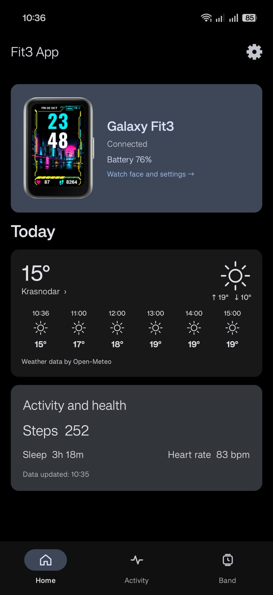
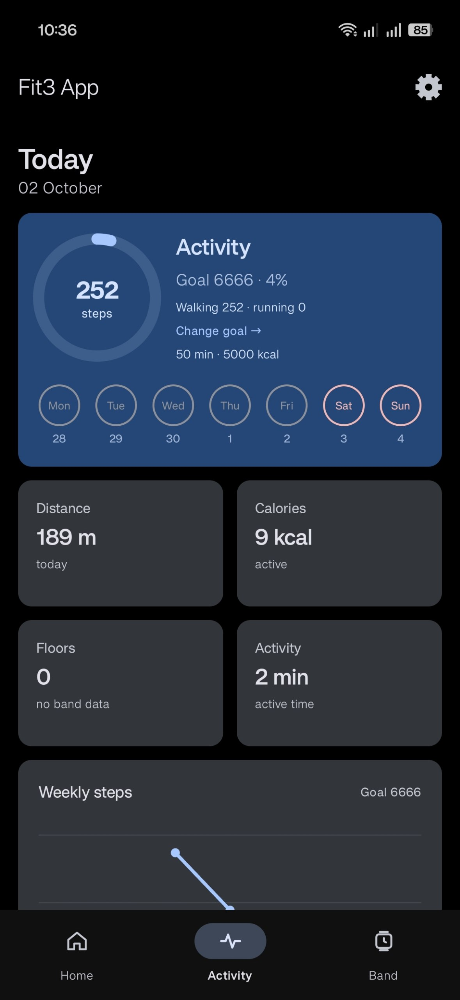
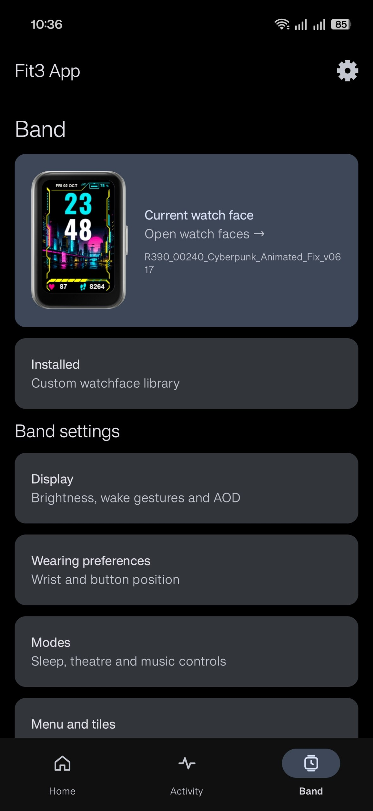

[🇷🇺 Русский](README_RU.md) | [🇬🇧 English](README.md)

# Fit3 App

An unofficial app for Samsung Galaxy Fit3 — an alternative to the official plugin for everyday use of the band.

The interface follows Material You. Russian and English are supported.

> The app is under development. Some features may be unstable or behave differently from the official app.

## Screenshots

  
  
  

## Features

- Connect to Galaxy Fit3 and sync activity and health data.
- Set daily goals for steps, active time, and activity calories.
- Forward notifications with app names and icons.
- Control music and send album artwork and a queue of up to 20 tracks, depending on the music player's capabilities.
- Weather on the phone and band, powered by Open-Meteo.
- Install custom watch faces from BIN files, view previews, and manage a local library.
- Configure the display, vibration, wearing preferences, tiles, and quick panel.
- Back up settings and saved data.
- Light, dark, and AMOLED themes, with adaptive and custom accent colors.
- Home screen card editor — **BETA**.
- Communication log and diagnostic tools.

## Requirements

- Samsung Galaxy Fit3 — SM-R390.
- A phone running Android 10 or later.
- Bluetooth and the necessary app permissions.

Notification access is required to forward notifications to the band and work with music apps. For a reliable connection, you may need to allow background activity and remove battery-saving restrictions.

## Installation

1. Download the APK from **Releases**.
2. Install the app and grant the necessary permissions.
3. Connect the band by following the instructions in the app.

Updates can be installed over the previous version. Saving a backup before updating is recommended.

Do not use Fit3 App and the official plugin to control the same band at the same time.

## Custom watch faces

Open **Band → Installed** and add a BIN file.

Importing saves the file in the app but does not send it to the band automatically. Tap a watch face to install it. Long-press to view the available actions.

You can create your own watch faces in [R390 Studio](https://github.com/yuriyurin/r390-studio).

## Reporting bugs

If you find a problem, open an **Issue** and include:

- Your Fit3 App version.
- Your phone model and Android version.
- Your band's firmware version.
- What happened and how to reproduce it.

## Author and support

Developer: **yuriyurin**

- [4PDA profile](https://4pda.to/forum/index.php?showuser=4729981)
- [❤️ Support development](https://www.donationalerts.com/r/yuriyurinnn)

## Acknowledgements

Weather data is provided by [Open-Meteo](https://open-meteo.com/).

## License

Copyright © 2026 yuriyurin. The Fit3 App source code is licensed under
[GNU GPLv3](LICENSE) (GPL-3.0-only).

Samsung artwork, third-party watch-face previews and content, and other
third-party components remain the property of their respective rights holders.
Their inclusion in this project does not relicense them under GPLv3; their own
terms apply. Fit3 App grants no rights to use or redistribute these materials.
See [third-party notices](THIRD_PARTY_NOTICES.md) for details.

## Disclaimer

Fit3 App is an independent project. It is not affiliated with or endorsed by Samsung. Names and trademarks belong to their respective owners.
