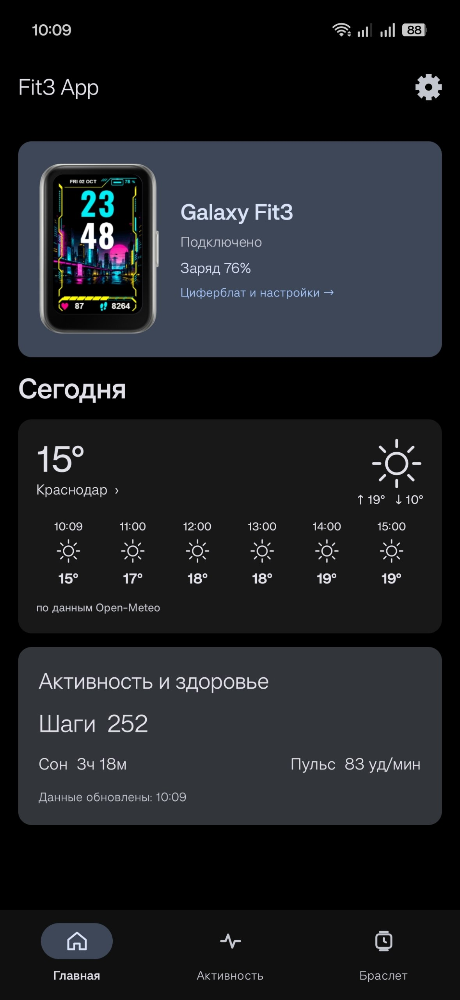
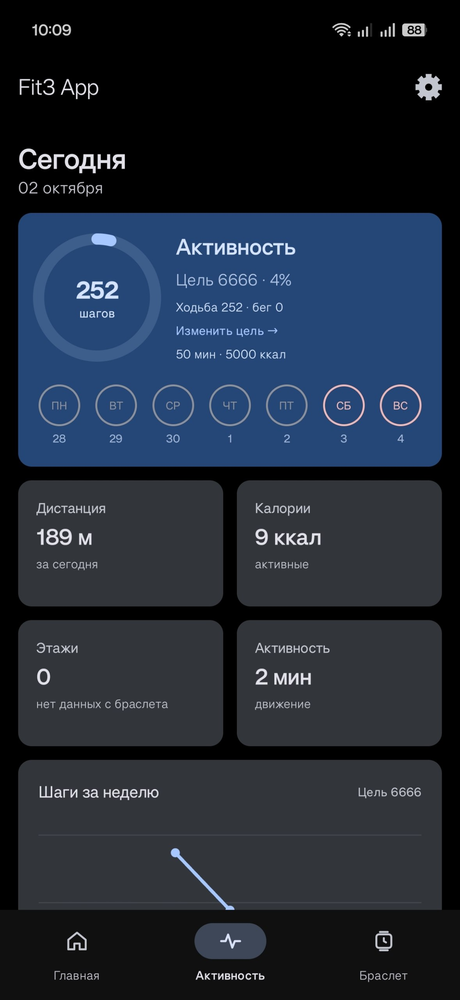
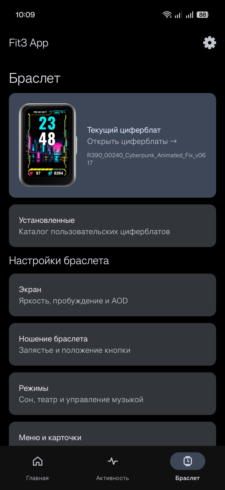

[🇷🇺 Русский](README_RU.md) | [🇬🇧 English](README.md)

# Fit3 App

Неофициальное приложение для Samsung Galaxy Fit3 — альтернатива официальному плагину для повседневного использования браслета.

Интерфейс выполнен в стиле Material You. Доступны русский и английский языки.

> Приложение находится в разработке. Некоторые функции могут работать нестабильно или отличаться от официального приложения.

## Скриншоты

  
  
  

## Возможности

- Подключение к Galaxy Fit3 и синхронизация данных активности и здоровья.
- Настройка ежедневных целей: шаги, время активности и потраченные калории.
- Передача уведомлений с названиями и иконками приложений.
- Управление музыкой, передача обложек и очереди до 20 треков — в зависимости от возможностей плеера.
- Погода на телефоне и браслете по данным Open-Meteo.
- Установка пользовательских циферблатов из BIN, превью и управление локальным каталогом.
- Настройка экрана, вибрации, ношения браслета, карточек и быстрой панели.
- Резервное копирование настроек и сохранённых данных.
- Светлая, тёмная и AMOLED-темы, адаптивные и пользовательские акценты.
- Редактор карточек главного экрана — **БЕТА**.
- Журнал обмена и инструменты диагностики.

## Требования

- Samsung Galaxy Fit3 — SM-R390.
- Телефон с Android 10 или новее.
- Bluetooth и необходимые разрешения приложения.

Доступ к уведомлениям нужен для их передачи на браслет и работы с музыкальными приложениями. Для устойчивого подключения может потребоваться разрешить фоновую работу и снять ограничения энергосбережения.

## Установка

1. Скачайте APK из раздела **Releases**.
2. Установите приложение и выдайте необходимые разрешения.
3. Подключите браслет, следуя подсказкам приложения.

Обновления устанавливаются поверх предыдущей версии. Перед обновлением рекомендуется сохранить резервную копию.

Не используйте Fit3 App и официальный плагин одновременно для управления одним браслетом.

## Пользовательские циферблаты

Откройте **Браслет → Установленные** и добавьте BIN-файл.

Импорт сохраняет файл в приложении, но не отправляет его на часы автоматически. Для установки нажмите на циферблат. Удержание открывает доступные действия.

Создавать собственные циферблаты можно в [R390 Studio](https://github.com/yuriyurin/r390-studio).

## Сообщения об ошибках

Если обнаружили проблему, создайте обращение в разделе **Issues**. Укажите:

- Версию Fit3 App.
- Модель телефона и версию Android.
- Версию прошивки браслета.
- Что произошло и как повторить проблему.

## Автор и поддержка

Разработчик: **yuriyurin**

- [Профиль на 4PDA](https://4pda.to/forum/index.php?showuser=4729981)
- [❤️ Поддержать разработку](https://www.donationalerts.com/r/yuriyurinnn)

## Благодарности

Погодные данные предоставляет [Open-Meteo](https://open-meteo.com/).

## Лицензия

Copyright © 2026 yuriyurin. Исходный код Fit3 App распространяется под
[GNU GPLv3](LICENSE) (GPL-3.0-only).

Изображения Samsung, превью и содержимое сторонних циферблатов, а также другие
сторонние компоненты не становятся собственностью проекта и не получают
лицензию GPLv3 только за счёт включения в него. Права на них принадлежат
соответствующим правообладателям; применяются их собственные условия.
Fit3 App не предоставляет прав на использование или распространение этих
материалов. Подробнее — в [сведениях о сторонних ресурсах](THIRD_PARTY_NOTICES.md).

## Отказ от ответственности

Fit3 App — независимый проект, не связанный с Samsung и не одобренный компанией. Названия и товарные знаки принадлежат их владельцам.
